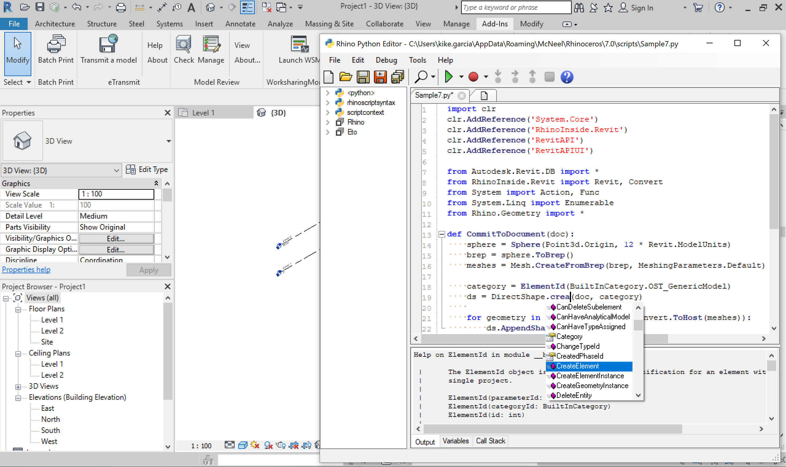
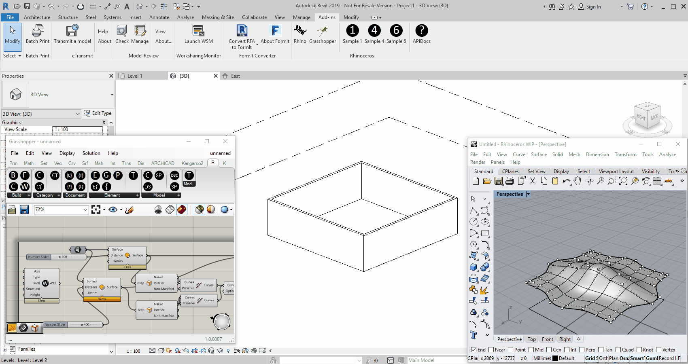
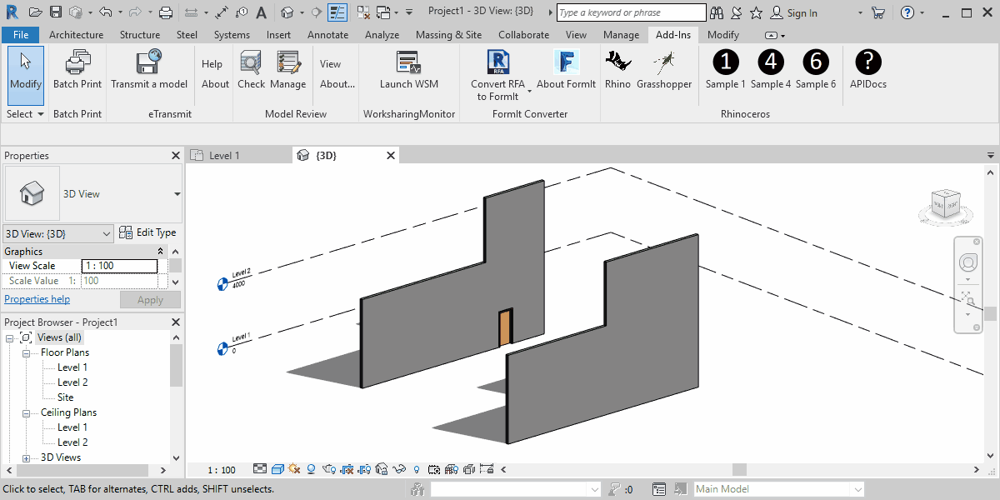
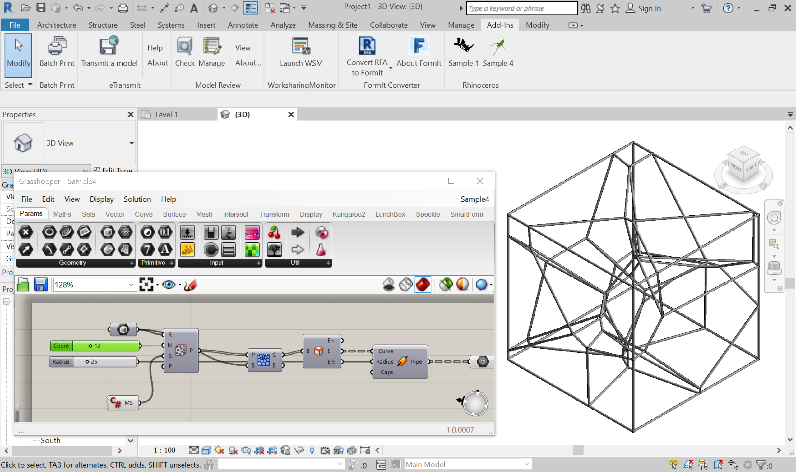

# Rhino Inside Revit
The Rhino Inside © technology allows Rhino and Grasshopper to be embedded within other products.

This folder contains a sample project that demonstrates:

1. Starting Rhino and Grasshopper as a Revit Addon.
2. Call directly into the native Revit APIs from a Grasshopper or Rhino plugin.
2. Grasshopper definitions can be opened and previewed in Rhino within the Revit process.
3. Object can be natively created by Rhino or Grasshopper within Revit through the API.

[**Questions?** *Visit the discussion forum...*](https://discourse.mcneel.com/c/serengeti/inside)

## Getting started
These instructions will get you a copy of the project up and running on your local machine for development and testing purposes.

### Prerequisites
* Git client. ([download](https://git-scm.com/downloads))
* Visual Studio 2017 ([download](https://visualstudio.microsoft.com/downloads/))
* .NET Framework 4.7 ([download](https://www.microsoft.com/net/download/visual-studio-sdks))
* Rhino WIP ([download](https://www.rhino3d.com/download/rhino/wip))
* Autodesk Revit 2017-2019 ([download](https://www.autodesk.com/products/revit/free-trial))
* Add this link to your bookmarks ;) ([Revit API docs](http://www.revitapidocs.com))

### Getting Source & Build
1. Clone the repository. At the command prompt, enter the following command:
```
git clone --recursive https://github.com/mcneel/rhino.inside.git rhino.inside
```
2. In Visual Studio: open _rhino.inside\Autodesk\Revit\RhinoInside.Revit.sln_.
3. Set the Solution Configuration drop-down according the Revit version you have installed. This will properly link the correct Revit API libraries to the project.
4. Navigate to _Build_ > _Build Solution_ to begin your build.

### Installing & Uninstalling
The project is configured to copy .addon file as well as output files to the folder _"%APPDATA%\\Autodesk\\Revit\\Addins\\%RevitVer%\\RhinoInside.Revit\\"_ folder in order to make Revit load this addon next time it runs.

In order to uninstall it you can use Visual Studio _Build_ > _Clean Solution_ command or just navigate to the folder _"%APPDATA%\\Autodesk\\Revit\\Addins\\%RevitVer%\\_ and remove the file _RhinoInside.Revit.addon_ and the folder _RhinoInside.Revit_.

## Using the samples
* Once you launch Revit it will warn you this addon is not verified, please click on "Load always" or "Load once".
* Create a new project or open an existing one.
* Now in the Add-ins Ribbon tab you have a _Rhinoceros_ section.
* Be careful about your model units in Rhino

### Sample 7


1. Use the _Pyhton_ icon into the Add-Ins tab to open Rhino Python editor window.
2. Load pyhthon script file called _"Sample7.py"_ there is in this folder.
3. Click on the green play button you will found on the Pyhton script editor window.
4. You should have an sphere in the Revil model.

### Sample 6


1. Use the _Rhino_ icon into the Add-Ins tab to open Rhino editor window.
2. Create some geometry in Rhino.
3. Click on the button on the _Rhinoceros_ panel called _Sample 6_.
4. You should have a preview of Rhino geometry in the Revit view.

### Sample 5


1. Open the ribbon tab called Add-Ins.
2. Click on the button on the _Rhinoceros_ panel called _Grasshopper_.
3. Open the _Revit_ tab in the Grasshopper toolbar.
3. Enjoy!!

### Sample 4


1. Open the ribbon tab called Add-Ins.
2. Click on the button on the _Rhinoceros_ panel called _Sample 4_.
3. Open _"Sample4.ghx"_ file.
4. The Grasshopper definition will be evaluated in background and the result baked in the Revit model.
5. You should have a collection of pipes over a 3D Voronoi diagram in Revit.

### Sample 3


1. Use the _Rhino_ icon into the Add-Ins tab to open Rhino editor window.
2. Create a surface on Rhino. (It is best if it is site size objects to start.)
4. Run _Grasshopper_ command.
5. Open _"Sample3.ghx"_ file in Grasshopper.
6. Inside Grasshopper using the _Surface_ param pick the breps you created in step 2.
7. Inside Grasshopper click on the button _Update Topography surface_.
8. You should have a Topography surface in Revit.

### Sample 2


1. Use the _Rhino_ icon into the Add-Ins tab to open Rhino editor window.
2. Create some breps in Rhino. (It is best if they are building size objects to start.)
3. Run _Grasshopper_ command.
4. Open _"Sample2.ghx"_ file in Grasshopper.
5. Inside Grasshopper using the _Brep_ param pick the breps you created in step 2.
6. The Value List component (looks like a dropdown selector) will allow you to specify which Revit OST Category you want geometry to be "baked" into.
7. Inside Grasshopper click on the button _Push to Bake_.
8. You should have the breps created in step 2 in the Revit model, and they should belong to the specified category (Generic is available and is also used as a catch-all fallback).

### Sample 1
1. Open the ribbon tab called _Add-Ins_.
2. Click on the button you will found on the _Rhinoceros_ panel called _Sample 1_.
3. You should have an sphere in the Revil model.
