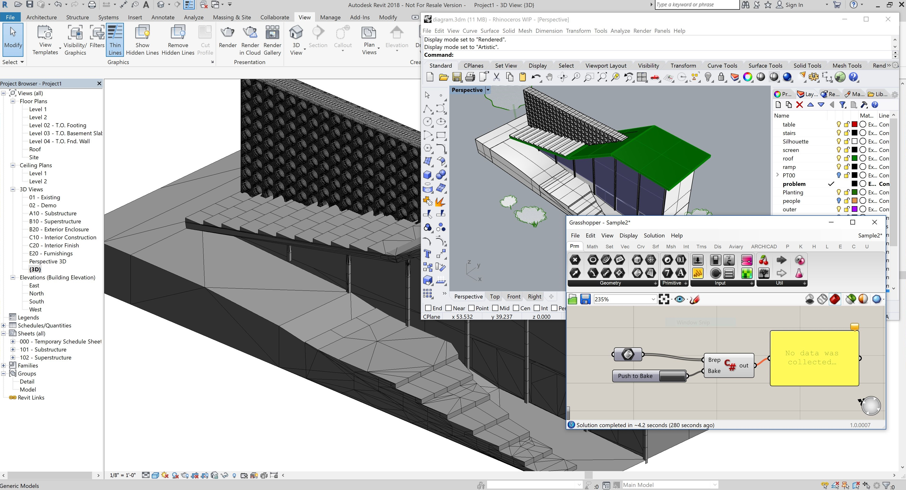

# Getting Started with Rhino in Revit

Here is how to get started with Rhino/Grasshopper in Revit.

After installing RhinoInside Revit, a toolbar will show up in Revit under Add-ons.

- The Rhino icon will start Rhino to run inside Revit.
- The Grasshopper icon will start the Grasshopper canvas to run inside Revit.  From here the GHRevit toolbar can be used.
- The Python button will start the Rhino.Python editor in Revit.
- Sample 1 will simply draw a Rhino sphere in Revit as a example for developers.
- The Grasshopper Player will run any existing Grasshopper definition and immediately return to Revit.

##  Running Rhino in Revit

While there is no direct command in Rhino to access Revit directly there are a number of simple ways Rhino geometry and be pushed into Revit from Rhino.  When Revit starts with the RhinoIndie add-on, Rhino and Grasshopper do startup in the background. Use the Rhino button in the Revit Toolbar to bring up the Rhino running indie.

Using a simple Grasshopper component seems the best way to get Rhino geometry into Revit. Press the Grasshopper button in Rhino to start Grasshopper.

<!---
How to push geometry into Revit?
How to push Revit geometry into Rhino?
Does there need to be commands for this?
Should it happen in Python Scripts?
-->

##  Running Grasshopper in Revit

Grasshopper can be started within

##  Running Rhino.Python in Revit

## Running the Grasshopper Player in Revit
